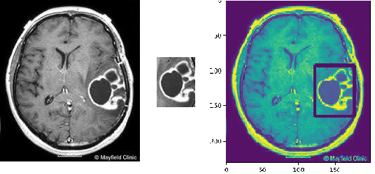

# Template Matching
```
This project is trying to implement Template Matching by using Normalised Cross Correlation
```
### Template Matching
```
File name: Template_Matching.py
Input image: brain.jpg
Input target: target.jpg
Command line >> python Template_Matching.py -i brain.jpg -t target.jpg
```
```
This program is finding a tumor in a MRI brain image.
```


Useful link for implementation:

- [Change Colorspace](https://github.com/Hank-Tsou/Computer-Vision-OpenCV-Python/tree/master/tutorials/Image_Processing/1_Changing_colorspace)
- [Image Filtering](https://github.com/Hank-Tsou/Computer-Vision-OpenCV-Python/tree/master/tutorials/Image_Processing/2_Image_Thresholding)
- [Youtube: Normalised Correlation Explanation with Demo](https://www.youtube.com/watch?v=ngEC3sXeUb4)

## Code
- [Image Matching](https://github.com/Hank-Tsou/Computer-Vision-OpenCV-Python/tree/master/tutorials/Image_Processing/10_Image_Matching)
- [Image Matching Implementation by Using Normalized Cross Correlation](https://github.com/Hank-Tsou/Implement-Edge-Detection)

## License

This project is licensed under the MIT License - see the [LICENSE.md](LICENSE.md) file for details

## Acknowledgments

* Author: Hank Tsou
* Contact: hank630280888@gmail.com
